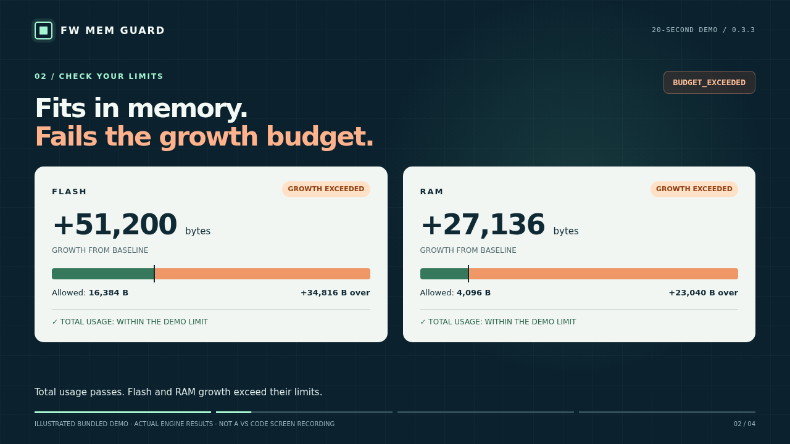

# FW Mem Guard — public documentation

**Your build grew. Know by how much.** Compare firmware Flash/RAM and check your chosen budgets locally in VS Code.

**[Download the 20-second demo video](https://raw.githubusercontent.com/itainover-create/fw-mem-guard/main/media/fw-mem-guard-demo.mp4)**, then open it in your video player. The guides below can be read directly on GitHub without downloading HTML files.

This repository contains public documentation and illustrated demo media only. The extension implementation is maintained separately.

- [Open the public website and watch the demo](https://itainover-create.github.io/fw-mem-guard/)
- [Install the pre-release](https://marketplace.visualstudio.com/items?itemName=fwmemguard.fw-mem-guard)
- [English quick start](START_HERE_EN.md)
- [מדריך התחלה בעברית](START_HERE_HE.md)
- [Support](SUPPORT.md) · [Privacy](PRIVACY.md)
- [20-second illustrated demo](media/fw-mem-guard-demo.mp4) · [Transcript](media/demo-transcript.html)
- [Demo result](media/demo-result.json) · [Result and media provenance](media/demo-evidence.json)

These guides accompany the 0.3.3 pre-release for Windows x64, Mac Apple Silicon and Mac Intel (native CLI/package checks on macOS 15.7.9; earlier versions unverified). Inside VS Code, run **FW Mem Guard: Open User Guide** for offline help.

The video illustrates actual results from the bundled engine and reduced-report exporter; it is not a VS Code screen recording or an installation acceptance test. Its capture timestamp is fixed for repeatable presentation. All firmware data in it is the bundled example, not customer firmware.

Support: `fwmemguard.support@gmail.com`. Public issues are visible to everyone: review diagnostic text and remove sensitive details before posting. Do not attach source, Map/ELF, credentials or customer artifacts.

The Pages workflow stages only the explicit documentation/media allowlist. There are no analytics, embedded third-party players or upload forms. GitHub hosting policies apply.

[Verified MicroPython example and guided setup](REAL_FIRMWARE.html) · [Download the F411 build pair](samples/micropython-f411-v1.24.1.zip). Independent GNU objdump reference output and third-party notices are included.

## First comparison and compatibility

[Follow the single trial path](https://itainover-create.github.io/fw-mem-guard/TRY_IT.html): install inside VS Code, run the demo and verified MicroPython example, compare your builds, save a project, then compare after a real rebuild. Host OS and firmware target requirements are documented separately there.
